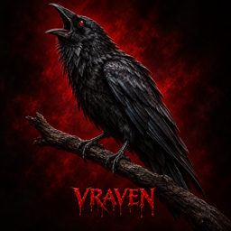
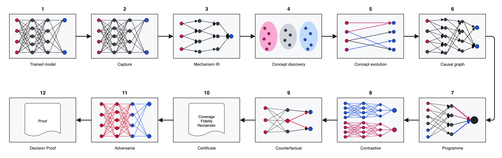

# VRAVEN documentation

  

  <strong>Visual Reasoning and Activation Visualisation for Explainable Networks</strong> 
  Evidence-aware explainability and causal model auditing for PyTorch.

  <a href="https://vraven-ai.github.io/vraven/"><strong>Open the documentation</strong></a> ·
  <a href="https://vraven-ai.github.io/vraven/guides/getting-started.html">Getting started</a> ·
  <a href="https://vraven-ai.github.io/vraven/api/">Python API</a> ·
  <a href="https://vraven-ai.github.io/vraven/cli/">Command line</a> ·
  <a href="https://vraven-ai.github.io/vraven/research.html">Research lineage</a>

VRAVEN helps researchers and practitioners examine how a trained neural network
reaches a decision. It captures internal evidence, tests candidate mechanisms
through controlled interventions and produces auditable reports that distinguish
observation from causal evidence. Models and traces remain local by default.

## The VRAVEN methodology

The methodology connects a trained model to an evidence-tested Decision Proof.
It moves through capture, Mechanism IR, concept discovery, concept evolution,
causal-graph construction, programme recovery, contrastive and counterfactual
analysis, certification, adversarial testing and final proof reporting.

  

The diagram describes the complete research workflow, not a claim that every
analysis automatically completes every stage. VRAVEN reports unsupported
operations, evidence coverage and unresolved computation explicitly.

## About this repository

This public repository hosts the documentation for
[`vraven-ai/vraven`](https://github.com/vraven-ai/vraven). Start with the
[documentation home](https://vraven-ai.github.io/vraven/) for installation,
model walkthroughs, API usage, command-line parameters, result interpretation
and the scientific foundations behind the project.
